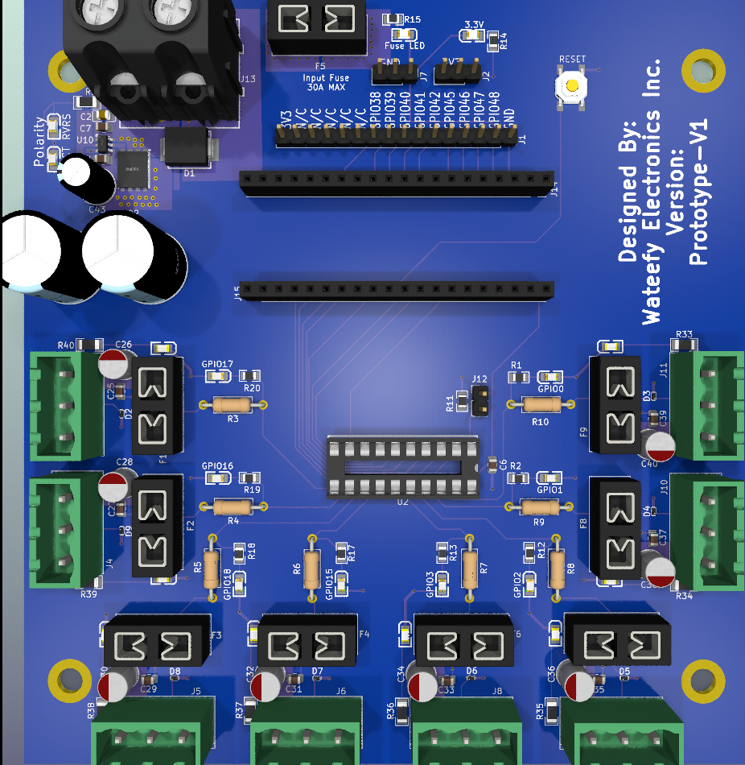

<p align="center">
  
  <a href="https://github.com/Aircoookie/WLED/releases"></a>
  <a href="https://raw.githubusercontent.com/Aircoookie/WLED/master/LICENSE"></a>
  <a href="https://wled.discourse.group"></a>
  <a href="https://discord.gg/QAh7wJHrRM"></a>
  <a href="https://kno.wled.ge"></a>
  <a href="https://github.com/Aircoookie/WLED-App"></a>
  <a href="https://gitpod.io/#https://github.com/Aircoookie/WLED"></a>

  </p>

# Welcome! ✨

A fast and feature-rich implementation of an ESP8266/ESP32 webserver to control NeoPixel (WS2812B, WS2811, SK6812) LEDs or also SPI based chipsets like the WS2801 and APA102!

## 🔌 Waveshare ESP32-S3-ETH Custom Build

This is a custom WLED build for the **Waveshare ESP32-S3-ETH** board with W5500 Ethernet support.

### 🚀 Quick Start (Get Flashing!)

**📥 Download Latest Firmware:**

**⚠️ Use v17** — this is the firmware line with full Ethernet protocol support (E1.31, Art-Net, DDP, MQTT over Ethernet). v16 is archived and does not route WLED protocols through Ethernet.

- Wrong network behavior or missing Ethernet: verify you flashed the v17 Waveshare target build.
- OTA failures: flash `.full.bin` over UART and retry setup.
 
Latest v17 builds:
https://github.com/johnvoipguy/WateefyElectronics/releases (filter for `waveshare-esp32s3-eth-v17`)

All releases:
https://github.com/johnvoipguy/WateefyElectronics/releases

**⚡ Flash Command:**
```bash
# First time (use FULL.bin)
esptool.py --chip esp32s3 --port COM3 --baud 921600 \
  write_flash 0x0 WLED_Waveshare_ESP32-S3-ETH_*_FULL.bin
```

See [detailed instructions below](#flashing-instructions) for more options.

- If you prefer web-based flasher:  [ESPConnect](https://thelastoutpostworkshop.github.io/ESPConnect/)

### Hardware Configuration
- **Board**: Waveshare ESP32-S3-ETH (ESP32-S3, 16MB Flash, 8MB PSRAM)
- **Ethernet**: W5500 SPI Ethernet (pins: MISO=12, MOSI=11, SCLK=13, CS=14, RST=9, INT=10)
- **LED Outputs**: 8 channels configured (GPIO 0, 1, 2, 3, 15, 18, 16, 17) — hardware-driven via 4 RMT + parallel I2S
- **Status LED**: GPIO21 (onboard, not available for pixel output)
- **Features**: MQTT, AudioReactive usermod enabled

### Flashing Instructions

#### Using esptool.py (Command Line)
1. Download the firmware from the [`firmware/`](firmware/) directory
2. Flash using esptool.py:

```bash
# Full flash (includes bootloader, partitions, and firmware) - RECOMMENDED for first time
esptool.py --chip esp32s3 --port /dev/ttyACM0 --baud 921600 \
  write_flash 0x0 firmware/WLED_Waveshare_ESP32-S3-ETH_*_FULL.bin

# Or OTA update only (if already running WLED - preserves settings)
esptool.py --chip esp32s3 --port /dev/ttyACM0 --baud 921600 \
  write_flash 0x10000 firmware/WLED_Waveshare_ESP32-S3-ETH_*_OTA.bin
```

Replace `/dev/ttyACM0` with your serial port (Windows: `COM3`, `COM4`, etc.)

**Download firmware files:** [firmware/README.md](firmware/README.md)

### Network Configuration

**v17 offers true dual-interface operation:**
- **Ethernet (W5500)**: Wired 10/100 Mbps, carries E1.31, Art-Net, DDP, MQTT — full protocol support
- **WiFi**: Backup control path and web configuration interface

#### Initial Setup Procedure
1. **First boot** (without Ethernet cable):
   - Device creates AP: `WLED-ETH-Config` (open, no password)
   - Connect to AP and configure WiFi via web interface (http://4.3.2.1)
   - Save settings and reboot

2. **Subsequent boots** (with Ethernet cable connected):
   - Ethernet: Gets DHCP address automatically (e.g., 192.168.50.239)
   - WiFi: Connects to configured SSID (e.g., 192.168.50.230)
   - Both interfaces active simultaneously — use Ethernet for LED streaming

#### Interface Capabilities (v17)

**Ethernet Interface** (primary for LED control):
- ✅ E1.31/sACN, Art-Net, DDP — **full protocol support over wire**
- ✅ MQTT
- ✅ HTTP/JSON API
- ✅ Web interface
- ✅ Ping/ICMP
- ✅ Low-latency, deterministic LED streaming

**WiFi Interface** (configuration and backup):
- ✅ Full web interface
- ✅ All UDP and TCP protocols
- ✅ Automatic failover if Ethernet drops
- ✅ OTA updates

#### Recommended Usage
- **Primary control**: Ethernet for xLights, sACN, Art-Net, and MQTT streaming
- **Configuration**: Web interface via Ethernet IP (primary) or WiFi if needed
- **Note on this firmware**: Waveshare v17 disables WiFi when Ethernet is connected. Other boards with different firmware keep both interfaces active.

### Technical Notes

v17 uses W5500 as a native Ethernet MAC/PHY interface (lwIP stack on ESP32 cores). This differs from v16's attempted hardware-socket offload, which proved non-functional — no WLED protocols actually reached Ethernet in v16. v17 trades some MCU cycles for correctness: the network stack runs in software, but every protocol that binds to lwIP works over Ethernet automatically.

### 🔧 Configuration Guide

#### First-Time Setup (WiFi Configuration Required)

**Step 1: Initial Boot WITHOUT Ethernet Cable**
1. Power on the board with **NO Ethernet cable connected**
2. Device creates access point: `WLED-ETH-Config` (open, no password)
3. Connect your phone/computer to this AP
4. Browser should auto-open to http://4.3.2.1 (or navigate manually)
5. Go to **Config → WiFi Setup**
6. Enter your WiFi SSID and password
7. Click **Save & Reboot**

**Step 2: Dual-Interface Operation**
1. After reboot, connect Ethernet cable to RJ45 port
2. Device will get two IP addresses (check your router's DHCP list):
   - **WiFi IP** (e.g., 192.168.50.230) - for web interface
   - **Ethernet IP** (e.g., 192.168.50.239) - for LED control protocols

**Step 3: Configure LED Settings**
1. Access web interface: `http://192.168.50.230` (WiFi) or `http://192.168.50.239` (Ethernet)
2. Go to **Config → LED Preferences**
3. Default LED pins: GPIO 0–7 (8 independent channels)
   - **Outputs 1–4**: Hardware RMT drivers (recommended for timing-critical strips like WS2812B)
   - **Outputs 5–8**: Software I2S drivers (automatic fallback when RMT is full)
4. Configure LED type per channel (WS2812B, SK6812, WS2811, etc.)
5. Set number of LEDs per channel
6. Save settings — no reboot required

#### AudioReactive Setup (Optional)
- **Microphone Input**: GPIO 4 (I2S) — requires external I2S microphone module (INMP441, ICS-43434, etc.)
- Enable in **Config → Usermods → AudioReactive**
- **Note**: I2S audio may conflict with outputs 5–8 if they require I2S parallel drivers; test your LED configuration first

#### Network Settings (Already Configured)
- **Ethernet Type**: W5500 SPI (pre-configured, Type 13)
- **DHCP**: Enabled on both interfaces; check router for assigned IPs
- **mDNS**: `http://wled-<chipid>.local` resolves over both WiFi and Ethernet (after WiFi is configured)

#### Important Notes
- ⚠️ **WiFi MUST be configured first** before connecting Ethernet
- ✅ Web interface accessible via both WiFi IP and Ethernet IP (v17)
- ✅ **Use Ethernet IP for E1.31/Art-Net/DDP LED streaming** (low-latency, deterministic, recommended)
- ✅ WiFi remains active as automatic failover if Ethernet drops

## ⚙️ Features
- WS2812FX library with more than 100 special effects  
- FastLED noise effects and 50 palettes  
- Modern UI with color, effect and segment controls  
- Segments to set different effects and colors to user defined parts of the LED string  
- Settings page - configuration via the network  
- Access Point and station mode - automatic failsafe AP  
- Up to 10 LED outputs per instance
- Support for RGBW strips  
- Up to 250 user presets to save and load colors/effects easily, supports cycling through them.  
- Presets can be used to automatically execute API calls  
- Nightlight function (gradually dims down)  
- Full OTA software updateability (HTTP + ArduinoOTA), password protectable  
- Configurable analog clock (Cronixie, 7-segment and EleksTube IPS clock support via usermods) 
- Configurable Auto Brightness limit for safe operation  
- Filesystem-based config for easier backup of presets and settings  

## 💡 Supported light control interfaces
- WLED app for [Android](https://play.google.com/store/apps/details?id=com.aircoookie.WLED) and [iOS](https://apps.apple.com/us/app/wled/id1475695033)
- JSON and HTTP request APIs  
- MQTT   
- E1.31, Art-Net, DDP and TPM2.net
- [diyHue](https://github.com/diyhue/diyHue) (Wled is supported by diyHue, including Hue Sync Entertainment under udp. Thanks to [Gregory Mallios](https://github.com/gmallios))
- [Hyperion](https://github.com/hyperion-project/hyperion.ng)
- UDP realtime  
- Alexa voice control (including dimming and color)  
- Sync to Philips hue lights  
- Adalight (PC ambilight via serial) and TPM2  
- Sync color of multiple WLED devices (UDP notifier)  
- Infrared remotes (24-key RGB, receiver required)  
- Simple timers/schedules (time from NTP, timezones/DST supported)  

## 📲 Quick start guide and documentation

See the [documentation on our official site](https://kno.wled.ge)!

[On this page](https://kno.wled.ge/basics/tutorials/) you can find excellent tutorials and tools to help you get your new project up and running!

## 🖼️ User interface


## 💾 Compatible hardware

See [here](https://kno.wled.ge/basics/compatible-hardware)!

## ✌️ Other

Licensed under the EUPL v1.2 license  
Credits [here](https://kno.wled.ge/about/contributors/)!

Join the Discord server to discuss everything about WLED!

<a href="https://discord.gg/QAh7wJHrRM"></a>

Check out the WLED [Discourse forum](https://wled.discourse.group)!  

You can also send me mails to [dev.aircoookie@gmail.com](mailto:dev.aircoookie@gmail.com), but please, only do so if you want to talk to me privately.  

If WLED really brightens up your day, you can [](https://paypal.me/aircoookie)


*Disclaimer:*   

If you are prone to photosensitive epilepsy, we recommended you do **not** use this software.  
If you still want to try, don't use strobe, lighting or noise modes or high effect speed settings.

As per the EUPL license, I assume no liability for any damage to you or any other person or equipment.  
