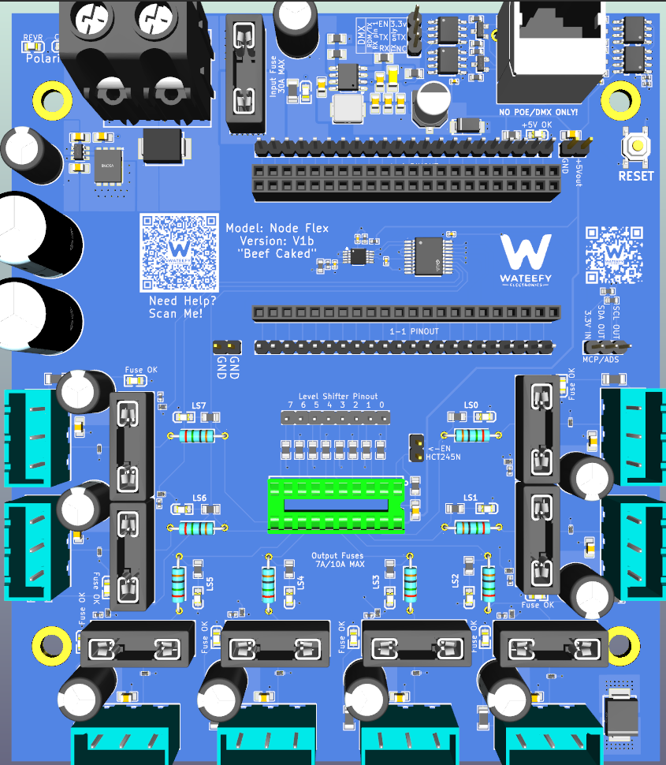

 

                          V1                                                                   V1b

# NODE Flex

### 8-Channel Addressable LED Controller · Universal Module Carrier

*Wateefy Electronics*

> **One board. Whatever module is in the drawer.**

---

## At a Glance

- **8 independent output channels** — WS281x / SK6812 / TM1814 family, 5 V level-shifted drive
- **Any ESP32 DevKit on 0.9″ or 1.0″ row spacing** — both spacings on the board, up to 22 positions per row, jumper-mapped to the outputs
- **5–48 VDC input, no voltage jumper** — nothing to set wrong, ever
- **30 A through the board at standard copper** — not a paid upgrade
- **Three isolated power domains** — dirty input, clean protected power, fused distribution bus
- **A fuse on every single output** — eight channels, eight fuses, no sharing
- **Non-destructive reverse-polarity protection** — nothing is consumed when someone wires it backwards
- **Four-port DMX-512 / RS-485 output** — per-port transient protection, one port receive-capable
- 123 × 138 mm · 4-layer · ENIG · conformal coated

---

## Why This Exists

Every ESP32 DevKit has a different pinout. Every controller board is hard-wired to exactly one of them. So the board you bought last year is scrap when that module goes end-of-life, and the four dev boards in your parts drawer are useless because none of them match the footprint someone else chose.

NODE Flex breaks that dependency by defining compatibility as **geometry rather than a part number**. The board carries both of the common DevKit row spacings — 0.9 inch and 1.0 inch — with up to 22 positions in each row. Module length does not matter: a 2×15 or 2×19 board seats in the same sockets and simply leaves positions empty. A jumper field then decides which module pin drives which output channel.

The practical result is that the compatibility list cannot go stale. If a module lands on 0.9″ or 1.0″ centres, it fits — including modules that do not exist yet. When your favourite DevKit is discontinued, and it will be, you seat a different one and keep going. Same board, same protection, same firmware.

For anyone maintaining an installed base across mixed hardware, this is the SKU that ends the inventory problem.

---

## The Architecture: Three Power Domains

Most controllers have one power rail. Input voltage lands on a terminal and it is the same copper that reaches your strips. Whatever arrives — spike, reverse polarity, sag, transient — arrives everywhere at once.

NODE splits power into three separate domains on their own copper planes:

**1 · Dirty power in.** The input terminal accepts whatever the supply, the wiring, and the person doing the wiring hand it. This domain is assumed hostile, isolated to the smallest region of the board possible, and nothing downstream touches it directly.

**2 · Clean power.** Between dirty and clean sits the protection stage: bidirectional transient clamping and an active reverse-polarity blocker. Reverse the supply and the pass element never turns on — no current path to the rest of the board, nothing sacrificed, red indicator tells you why. Correct the wiring and it recovers on its own.

**3 · The protected bus.** Clean power passes the main fuse to become the distribution bus. Each of the eight output channels taps that bus through its own fuse. A fault on run six opens one fuse and the other seven never notice.

> **BEEFCAKE.**
> The pass element is an 80 V MOSFET whose current rating is several times the board's 30 A design load. It will never be the thing that fails.

**Decoupling where the current actually is.** Two thousand microfarads of bulk sits on the protected bus, and another forty-seven at every single output connector. The distribution is the point: one reservoir at the input cannot cover the harness inductance of eight separate output runs no matter how large it is. When a full-white frame lands on all eight channels at once, each channel draws from its own reserve sitting centimetres from its terminal.

Four levels between the screw terminal and your pixels — clamp, active block, main fuse, channel fuse — each on its own copper. That is why this is a four-layer board with a split inner power plane rather than two layers and one pour.

Nothing in the pixel power path is rated below **63 V** — and every semiconductor in it is **60 V or above** — against a 48 V absolute maximum input. Nothing in the chain runs near its limit.

At the **36 V nominal** rating, no component in the power path operates above **60 %** of its own rating. At the **48 V absolute maximum**, nothing exceeds **80 %**. On the 5 V, 12 V and 24 V strips that carry the overwhelming majority of installations, the entire plane runs under **40 %**. It is not a number anyone else in this class publishes, and it is the reason to believe the rest of this page.

---

## What Else You Actually Get

**Defined-state inputs.** Because a channel's jumper may legitimately be left unset, every buffer input carries a pull-down resistor. An unconfigured channel sits at a known logic low instead of floating and driving whatever it feels like — which on a strip full of pixels means darkness rather than noise. This is the detail that separates a real universal carrier from a breakout board with headers.

**Data lines treated like data lines.** Each output runs through a series resistor and a sub-picofarad ESD device placed on the connector side, where transients actually arrive. The low-capacitance part was chosen deliberately: a fat protection diode on a data line rounds off WS281x bit timing and produces a controller that works on the bench and sparkles on a 40-foot run.

**DMX where you need it.** Four RS-485 ports on RJ45, each with its own transceiver and its own transient protection, alongside the eight pixel channels.

> **Three things on this board can be killed by field abuse. All three pull out by hand.**
>
> **The fuse.** A mini blade — the same part sold in a variety pack at every gas station, auto parts counter and big-box store in the country. Pulls with fingers, costs pennies. Not a cartridge you order online and wait for.
>
> **The buffer.** A jellybean octal logic IC in a DIP socket. It sits directly behind your wiring, which makes it the part most likely to die and the part most annoying to replace anywhere else. Here it lifts out with a fingernail. And the socket accepts either of two common octal logic families — a strap on pin 1 handles the output-enable behaviour of one and the direction pin of the other — so you fit whichever is in stock. Supply-chain resilience on a fifty-cent line item sounds trivial right up until the next shortage.
>
> **The MCU.** A socketed module. Blow it up, seat another. No hot air, no braid, no scrap board.
>
> Nobody else in this class can claim all three.

And that is what the board area buys. Blade holders, a DIP socket, and terminal clearance cost real estate — there is room to get an iron in, room to pull a fuse without tweezers, room to reach the reset button without unmounting anything, and room at the terminals for heavy wire with ferrules. Compact is easy. Compact *and serviceable* at 30 A is a different problem, and this is the side of it we chose. A channel that dies at eight o'clock on the twenty-third of December should be a fifteen-minute drive, not a three-day wait.

**Serviceable by design.** The level shifter sits in a DIP socket. The DevKit sits in headers. Fuses pull by hand. Through-hole parts dominate the power section on purpose — this board is meant to be repaired, not replaced.

---

## Where It Goes

- **Mixed-hardware installations** — one controller SKU across a fleet built from whatever modules were available that year
- **Development and evaluation** — swap modules against a known-good, fully protected carrier
- **Long-life deployments** — the board outlives the module generation it was built around
- **Distributed whole-property displays** — one node per zone, eight runs each, scale by adding nodes

---

## How It Compares

*Comparison basis.* The closest peer is the Bong69 8 Port LED Distro — same idea, power and data integrated on one board, eight ports, WLED, sold at maker scale. QuinLED's Dig-Quad is the other reference point. Competitor figures are taken from the vendors' own published FAQ and specification pages as of July 2026 and should be re-verified before publication.

Athom's WLED range is deliberately excluded: single-strip and PWM controllers aimed at room-level and audio-reactive use. Different product, different buyer.

| | **NODE Flex** | **Bong69 8 Port LED Distro** | **QuinLED-Dig-Quad v3** |
|---|---|---|---|
| Output channels | 8 | 8 | 4 |
| MCU compatibility | Any DevKit on 0.9″ or 1.0″ row spacing, any length up to 22 positions | Fixed — WT32-ETH01 integrated | Fixed footprint — QuinLED-ESP32 or D1 Mini 32 |
| Survives module obsolescence | Yes — jumper a different DevKit | No — board is the module | No |
| Input range, one SKU | 5–48 VDC | V4: 12–48 V (5 V support dropped) · V3: 5–24 V (discontinued) | 5–24 VDC |
| Covers 5/12/24/36 V pixels | Yes, one board | No — requires choosing a version | Jumper-selectable up to 24 V; 36 V not supported |
| Input voltage selection | None — nothing to set wrong | Per board version | Jumper; vendor warns wrong setting "will fry the onboard components" |
| Input connector | Enclosed 57 A screw terminal | V4: spade connectors on a stud | Screw terminal |
| Continuous current, standard copper | 30 A | Not published | 15 A at 1 oz (30 A only with paid 2 oz upgrade) |
| Per-channel fuse rating | 7.5 A nominal · 10 A max per output | 5 A (V4) · 4 A hold / 8 A trip polyfuse (V3) | 10 A max recommended |
| Fuses on outputs | 8 — one per channel | 8 — one per channel | 5 fuses across 7 outputs (channels share) |
| Reverse-polarity protection | Active blocking — non-destructive, self-recovering | Not published | Parallel diode with fuse — sacrificial |
| Input transient clamp | Bidirectional TVS across the input | Not published | Not published |
| Data-line ESD protection | Per channel, sub-pF device | Series resistor only (33 Ω) | Not published |
| Power domain separation | 3 domains: dirty in / clean / fused bus | Not published | Single rail |
| Unconfigured input handling | Pull-down on all 8 buffer inputs | n/a — fixed pinout | n/a — fixed pinout |
| DMX-512 / RS-485 output | 4 ports, individually protected | Not published | Not published |
| Level shifter | 8-channel, socketed DIP | Not published | 4-channel, soldered |
| Conformal coating | Yes, applied at the fab | Not offered | Not offered |
| Fuse-status indicator | Per-channel LED | Blue "good fuse" LED per channel | Per board |
| Onboard USB programming | Via the module's own port | Onboard USB-C — required, the ESP is soldered down | Via the module's own port |
| Field-replaceable MCU | Yes — socketed module | No — ESP32-WROOM soldered to the board | Yes — socketed module |
| Fuse replacement | Mini blade — auto parts store, gas station, variety pack | Cartridge in a surface-mount holder — order online | ATO blade — auto parts store |
| Audio-reactive / mic support | DIY — headers fitted, spare GPIO available | DIY — wire an INMP441 to the H1 header (documented) | Analog audio input broken out |
| Temperature sensor support | DIY — headers fitted, spare GPIO available | DIY — add header, DS18B20 and 4.7 kΩ (documented) | Optional onboard footprint |
| Enclosure | Coming soon | None — 3D-print mounts published | None — bare board |
| Board size | 123 × 138 mm — the cost of blade holders, a DIP socket and terminal clearance | ~110 × 70 mm | ~100 × 50 mm |
| Firmware | WLED / ESPHome / ESPixelStick — module-level, not board-level | Same | Same |
| Firmware image | Pre-built image supplied per module | Pre-built image supplied; ESPixelStick needs the vendor hardware profile | Stock WLED builds |
| Ecosystem | New | Established, reviewed, xLights docs | Large, mature, well documented |

*A note on firmware comparisons.* WLED, ESPHome, and ESPixelStick are properties of the ESP32 silicon, not of the carrier board — any of them will run on any of these products. What actually differs is which pre-built image ships, and how much GPIO the board's own hardware has already spent before your channels get any.

**Where the others are the better choice, plainly.** Bong69 ships a proven, well-reviewed board with onboard USB-C programming, per-fuse status LEDs, documented audio-reactive and temperature-sensor support, xLights integration notes, published 3D-print mounts, and boards that arrive pre-configured and tested. QuinLED brings a deep peripheral breakout and years of community documentation. Neither ecosystem exists here yet. If you want established products, buy theirs.

**Where NODE Flex is the better choice.** Every competing board *is* its module — when that ESP32 variant goes end-of-life, the board goes with it. NODE Flex is a carrier: the module is a consumable, the protected power section is the product. Add one board covering 5/12/24/36 V pixels with every part in the power path well below its rating — no version to pick, eight fuses for eight channels, an enclosed 57 A terminal instead of exposed lugs, and four levels of protection on separate copper.

**The honest summary:** buy Bong69 or QuinLED if you want the mature ecosystem and never intend to change modules. Buy Flex if you have four different DevKits in a drawer, or if you expect to still be maintaining this installation after the current module generation is gone.

---

## Mounting & Enclosure

**No enclosure is included, and none is planned.** This is the norm in this segment — bare board, mounted in whatever the installation already uses: a CG1500, a DIN rail, a weatherproof box, a plywood backer.

What NODE adds instead is **conformal coating, applied at the fabrication facility** with connectors, sockets, fuse clips, and switches masked. Competing boards in this class ship uncoated. A coated board in a vented enclosure tolerates condensation and humidity in a way a bare board does not, which matters for the seasonal outdoor installs this was built for.

Four corner mounting holes are provided. *Hole spacing and a downloadable mount STL: to be published at first article.*

---

## Build & Assurance

- **Fabrication** — 4-layer, 1.6 mm, high-Tg substrate, ENIG finish, epoxy-filled and capped vias, IPC Class 2 workmanship
- **Assembly** — professional SMT assembly, flying-probe electrical test on 100% of boards
- **Traceability** — 2D barcode serial on every board; UL-recognized substrate marking
- **Coating** — conformal coating applied at the fab, with connectors, sockets, fuse clips, and switches masked
- **Design review** — every net verified against manufacturer datasheets; schematics independently reviewed by two automated analysis passes with human verification of every finding

---

## Ordering

| Item | Detail |
|---|---|
| Model | NODE Flex |
| Configuration | Assembled, tested, conformal coated |
| Included | Controller board, level shifter installed, fuses installed |
| Not included | Enclosure, ESP32 DevKit module, jumper shunts, 3-pin plug connectors, blade fuses beyond those fitted, power supply |
| Availability | Pre-release. The present build is a validation run — first-article hardware for bring-up, characterisation and field trial. |
| Price | TBD |
| Lead time | TBD |
| Warranty | TBD |

---
---

# NODE Flex — Technical Specification

**Document rev:** 3.0 · **Board rev:** V1a · **Date:** 2026-09-01

> **Components are specified by function and rating.** Specific manufacturers and part
> numbers are selected at build time and may change with availability; every substitution
> is held to the ratings stated here.

## 1. Power Architecture

Three separate domains, each on its own copper region:

| Domain | Boundary | What it carries |
|---|---|---|
| **Input (unprotected)** | Screw terminal → ideal-diode stage | Raw supply. Assumed hostile. Transient clamp sits across this node. |
| **Clean (protected)** | Ideal-diode output → main fuse | Reverse-blocked, surge-clamped. Bulk capacitance lives here. |
| **Distribution bus (fused)** | Main fuse → 8 channel fuses + logic regulator | Everything downstream taps this bus through its own fuse. |

## 2. Input & Protection

| Parameter | Value | Notes |
|---|---|---|
| Pixel input voltage range | 5 – 48 VDC | 36 V nominal, 48 V absolute maximum |
| Input connector | Enclosed 2-pole screw terminal | 57 A / 10 mm² rated; 30 A design maximum = 53% of rating |
| Maximum continuous current | 30 A | At standard 1 oz outer copper — no copper upgrade required |
| Main fuse | 30 A mini blade, user-replaceable | Holder rated 30 A / 500 V |
| Reverse-polarity protection | Ideal-diode controller driving a high-side N-channel pass FET | FET held off under reverse input; no current path to load; non-sacrificial and self-recovering |
| Pass element | 80 V N-channel MOSFET, low milliohm RDS(on) | Rated above the input clamp voltage, not below it; current rating several times the 30 A design load |
| Input transient clamp | Bidirectional TVS, 1500 W, 48 V standoff | Conducts in neither direction at rated input; polarity-independent |
| Bulk capacitance | 2 × 1000 µF, 63 V | On the clean rail, downstream of the ideal diode |
| Ideal-diode support | 100 V charge-pump capacitor, 80 V hold-up capacitor | Per the controller's reference design |
| Polarity indication | Anti-parallel green/red LED pair | Green = correct, red = reversed; shared limit resistor sized for the full input range |

**Voltage headroom summary: 36 V nominal, 48 V absolute maximum.** Every component in the power path is rated **63 V or above**; every semiconductor is **60 V or above**.

**Derating against input voltage.** Utilization of each component's own rating. **5 V, 12 V and 24 V are the mainstream pixel voltages** and are shown in bold:

| Component | Rating | **5 V** | **12 V** | **24 V** | 36 V | 48 V |
|---|---|---|---|---|---|---|
| Bulk input capacitors | 63 V | **8 %** | **19 %** | **38 %** | 57 % | 76 % |
| Channel output caps | 80 V | **6 %** | **15 %** | **30 %** | 45 % | 60 % |
| Ideal-diode hold-up | 80 V | **6 %** | **15 %** | **30 %** | 45 % | 60 % |
| HV-plane ceramics | 100 V | **5 %** | **12 %** | **24 %** | 36 % | 48 % |
| Ideal-diode controller | 65 V | **8 %** | **18 %** | **37 %** | 55 % | 74 % |
| Pass MOSFET VDS | 80 V | **6 %** | **15 %** | **30 %** | 45 % | 60 % |

At the **36 V nominal** rating no part on the plane exceeds 60 % of its own limit. At the **48 V absolute maximum** nothing exceeds 80 %. On the 5 V, 12 V and 24 V strips that carry the overwhelming majority of installations, the entire plane runs under 40 %.

## 3. 5 V Logic Rail

| Parameter | Value | Notes |
|---|---|---|
| Regulator | Wide-input synchronous buck, thermally-padded package | Sat on the distribution bus; 12 thermal vias under the pad |
| Absolute maximum input | 80 V class | Well above the 48 V absolute-maximum input |
| Switching frequency | 400 kHz | Set by a fixed timing resistor |
| Output voltage | 5.1 V nominal | Resistive divider against a 1.0 V reference |
| Output current capability | 2 A | Actual load ≈ 0.5 A → 25% utilization |
| Inductor | 15 µH, 3.0 A saturation, 2.5 A RMS | 79% of saturation rating at the full 2 A load |
| Output capacitance | 3 × 22 µF ceramic | Per regulator reference design |
| Input capacitance | 4.7 µF + 100 nF ceramic, 100 V X7R, plus 80 V electrolytic bulk | Rated for the full input range with derating headroom |
| 5 V rail clamp | Unidirectional TVS, 6 V standoff | Cathode to the +5 V rail, anode to ground |
| Minimum on-time margin | 2.7× at 36 V input | No frequency foldback anywhere in the input range |
| Manual reset | Momentary switch to regulator enable | Pull-up to the distribution bus |

## 4. Outputs

| Parameter | Value | Notes |
|---|---|---|
| Channels | 8 | Independent, individually fused — no shared fuses |
| Output connector | 3-pole pluggable terminal, per channel | V+ / DATA / GND; 12 A rated → 63% at the 7.5 A fitted fuse, 83% at the 10 A maximum |
| Per-channel fuse | 7.5 A mini blade fitted, 10 A maximum | 25% of holder rating at 7.5 A, 33% at 10 A; user-replaceable |
| Level translation | Octal logic buffer, DIP-20 socket | Accepts either of two common octal families; 3.3 V drive against a 2.0 V VIH = 1.3 V margin |
| Data series resistance | 330 Ω, axial through-hole, per channel | Limits fault current back into the buffer |
| Data ESD protection | Sub-picofarad ESD device, per channel, connector side | 0.4–0.55 pF junction capacitance; RC ≈ 181 ps — no measurable effect on WS281x bit timing |
| Data drive current | ≈ 4 mA per channel | 67% of the ±6 mA buffer rating |
| Buffer supply current | ≈ 45 mA total | 64% of the 70 mA device maximum |
| Per-channel decoupling | 47 µF electrolytic 80 V + 100 nF ceramic 100 V | Local to each output connector |
| Channel activity indication | One LED per channel | Data activity on that channel |
| Fuse-status indication | One LED per channel, fed from the post-fuse node | Lit = that channel's fuse is intact and the bus is live |
| Buffer input pull-downs | 10 kΩ to ground, all 8 inputs | Defines logic low when a channel jumper is not fitted; ~330 µA sink at logic high |

### 4b. DMX-512 / RS-485 Output

| Parameter | Value | Notes |
|---|---|---|
| Ports | 4 | RJ45, T568B pairing |
| Transceivers | One RS-485 transceiver per port | Driver enables tied to a shared enable net; transmit data shared across all four |
| Receive | Port 1 only | The remaining three ports are transmit-only by design |
| Port protection | TVS array on the connector-side net, plus series resistance per line | Clamp sits ahead of the series limiting, in that order |

## 5. MCU Interface & Firmware

| Parameter | Value |
|---|---|
| Module support | Any ESP32-family DevKit on a supported row spacing *(module not included)* |
| Supported row spacings | 0.9″ (22.86 mm) and 1.0″ (25.4 mm) — both provided on the board |
| Socket rows | 2.54 mm pitch, up to 22 positions per row |
| Module length | Not constrained — shorter modules (2×15, 2×19) seat in the same rows, leaving positions unused |
| Channel assignment | Jumper header maps module GPIO to each of the 8 buffer inputs |
| Unconfigured channels | Held low by pull-down — no floating inputs |
| Buffer enable | Strap-selectable buffer output enable |
| Firmware | WLED — pre-built image supplied, configured for the fitted module's GPIO map |
| Supported LED protocols | WS2811, WS2812/B, WS2813, WS2815, WS2816, SK6812/RGBW, TM1814, and other single-wire families supported by WLED |
| Connectivity | Per installed module — Wi-Fi 2.4 GHz, or wired Ethernet / PoE-Ethernet where the DevKit provides it |
| Verified Ethernet DevKits | WT32-ETH01, WT32-ETH01-EVO and WT32-ETH02-PLUS all sit on 0.9″ (22.86 mm) centres and seat directly, leaving one free socket row per side |
| Known non-fitting modules | Olimex and LilyGo boards use non-standard row spacings and will not seat directly — they require an adapter or hand-wiring. Check your module's row centres against 0.9″ / 1.0″ before ordering |
| Control protocols | Per WLED: E1.31/sACN, Art-Net, DDP, MQTT, HTTP/JSON API. DMX-512 over the onboard RS-485 ports |
| Additional I/O | Spare module GPIO broken out on fitted headers for I²C and SPI peripherals, plus 3.3 V / 5 V / GND / TX / RX. Availability depends on the fitted DevKit |

> **Integrator note:** confirm that the GPIO assigned to a channel is not a boot-strapping pin on your specific module, and is free of flash or PSRAM duties. Pin restrictions vary by module and remain the integrator's responsibility.

## 6. Physical

| Parameter | Value |
|---|---|
| PCB dimensions | 123 × 138 mm |
| PCB thickness | 1.6 mm |
| Layer count | 4 — signal / ground plane / split power plane / signal |
| Copper weight | 1 oz outer, 1 oz inner |
| Substrate | High-Tg 155 °C |
| Surface finish | ENIG, 1 µ" gold |
| Via treatment | Epoxy filled and capped |
| Soldermask | Blue |
| Mounting | 4 × corner mounting holes, 3 mm |
| Mounting hole spacing | 107.9 × 103.8 mm |
| Enclosure | Coming soon |
| Net weight | TBD — measure at first article |
| Conformal coating | Applied at the fab; connectors, sockets, fuse clips, and switches masked |

## 7. Environmental & Compliance

| Parameter | Value |
|---|---|
| Operating temperature | −20 °C to +60 °C *(design target; not qualification tested)* |
| Substrate rating | UL-recognized, JLC-1 marking |
| RoHS | Compliant |
| Workmanship | IPC Class 2 |
| Electrical test | Flying-probe, 100% of boards |
| Traceability | 2D barcode serial number, per board |

## 8. Design Notes & Accepted Limitations

Stated plainly rather than buried:

- **Not automotive qualified.** Protection targets transients credible in a residential or light-commercial installation. Not tested to ISO 7637 load-dump profiles; not intended for vehicle use.
- **Worst-case clamp coordination.** At the TVS datasheet maximum clamping voltage under a full rated pulse, the voltage presented to downstream components exceeds their ratings. That condition requires a pulse energy source which does not exist in a mains-fed low-voltage installation, and is accepted as non-credible for the intended deployment. At realistic clamp currents the entire downstream chain retains margin.
- **Over-voltage beyond specification is not survivable.** A supply above the rated input range will conduct the input TVS and open the main fuse. Sacrificial by design — the board is protected, the TVS and fuse are consumables.
- **Module compatibility is defined mechanically, and validated electrically by the integrator.** Any DevKit on 0.9″ or 1.0″ row spacing will seat. Whether a given GPIO on that module can drive an output channel is a separate question: strapping pins, flash and PSRAM duties, and input-only pins differ by module and must be checked against the module's own documentation before assigning channels. Olimex and LilyGo boards use non-standard row spacings and will not drop straight in — they need an adapter or hand-wiring to reach the socket rows.
- **Load capability.** The 5 V rail powers onboard logic and indicators only. Pixel power comes directly from the distribution bus; total system current is bounded by the 30 A main fuse and the user's supply.

---

*Wateefy Electronics · NODE Flex · Specifications subject to change.*
